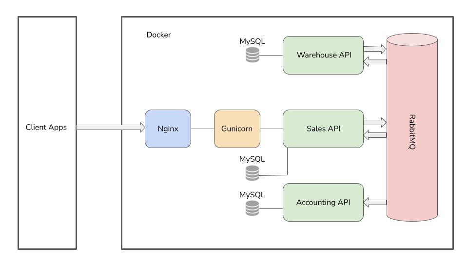
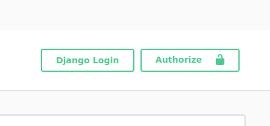
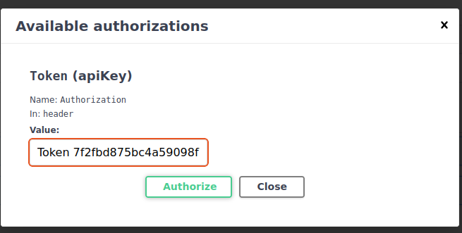

The microservices have created by Django Framework. They use MySQL databases. 
Every microservice works by Gunicorn and get client's requests through Nginx proxy server.
All microservices sending messages to each other by RabbitMQ server.

The Warehouse sends messages to Sales when Item instances changes. 

The Sales sends messages to Warehouse and Accounting then Order and Item change.

The Accounting only receive messages from Sales.

The Projects can be deployed by Docker container. After cloning the projects use these commands:

    $ cd brewery
    $ sudo docker-compose build
    $ sudo docker-compose up -d
    

 

**1. Warehouse Microservice API**

API methods to get, create, update or delete Items 

All methods are available for Admins. New admins can register by the admin panel.

The admin panel is available via link: http://31.171.250.203/warehouse/admin

    superuser login: admin_warehouse
    superuser password: admin_warehouse

The API's docs are available via link: http://31.171.250.203/warehouse/swagger/

The API is available via link: http://31.171.250.203/warehouse/api/v1/

You need to get Token for Authentication to have access:

POST http://31.171.250.203/warehouse/api/v1/token-auth/

    {
        "username": "admin_warehouse",
        "password": "admin_warehouse"
    }

Response:
    
    {
        "token": "7f2fbd875bc4a59098f7fcccbb3a640510f65a52"
    }
Use token with prefix: **Token** 7f2fbd875bc4a59098f7fcccbb3a640510f65a52

You can log in via swagger docs by the Authorize button.
 

_______________________________________________________________________________________
**2. Sales Microservice API**

API methods to get, create, update or delete Orders and to get Items

The admin panel is available via link: http://31.171.250.203/sales/admin

    superuser login: admin_sales
    superuser password: admin_sales

The API's docs are available via link: http://31.171.250.203/sales/swagger/

The API is available via link: http://31.171.250.203/sales/api/v1/

You need to register and get Token for Authentication to have access to API: 

POST http://31.171.250.203/sales/api/v1/token-auth/

All methods are available for any **authentication** users. 

New users can register via POST method: http://31.171.250.203/sales/api/v1/register/

Response:

    {
        "response": "You've been registered"
    }   

__________________________________________________________________________________________

**3.Accounting Microservice API**

API methods to get an Orders Items with the extra field *"total_sum"*

All methods are available for Admins. New admins can register by the admin panel.

The admin panel is available via link: http://31.171.250.203/accounting/admin

    superuser login: admin_accounting
    superuser password: admin_accounting

The API's docs are available via link: http://31.171.250.203/accounting/swagger/

The API is available via link: http://31.171.250.203/accounting/api/v1/

